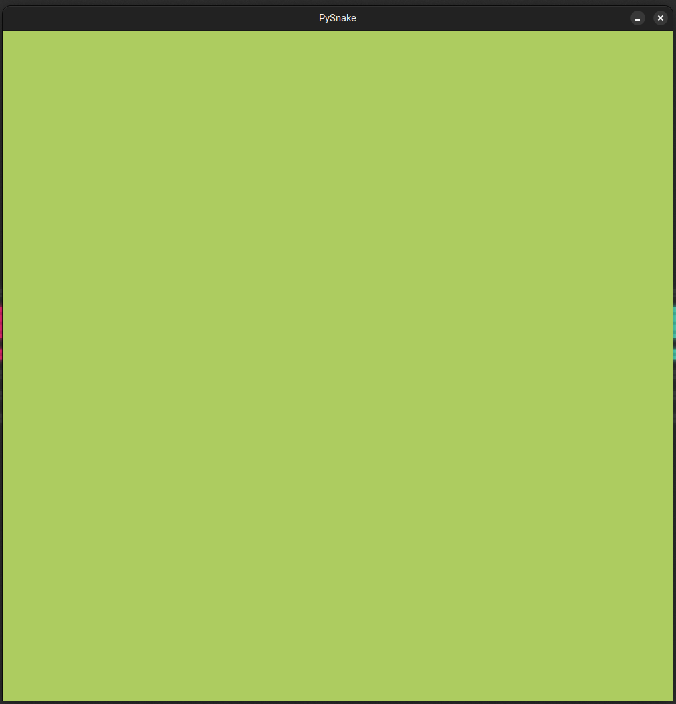

# PygameBasics
---
তোমরা এখানে! আরে আরে কোথায় যাও! এসে যখন পড়েছো, Game development এবং Pygame সম্পর্কে কিছু শিখে যাও। 

#### # Pygame আবার কোন গেম? (◔_◔)
---
ধুরো! Pygame কোনো game না। ইহা Python এর একটি library যা দিয়ে আমরা গেম বানাতে পারি। আমি ধরে নিচ্ছি যে তোমরা সবাই Python এবং Python এর basic জানো। আমরা আজকে python এবং programming এর basic নিয়ে তেমন কিছু আলোচনা করবো না। 

শিখার যাত্রাটা Pygame install করার মাধ্যমে শুরু করলে খারাপ হয় না। Pygame install এর জন্য আমাদের কম্পিউটারে Python থাকতে হবে। যদি Python না থাকে তাহলে [python.org](https://www.python.org/downloads) থেকে stable version ডাউনলোড করে নিতে পারো। 

এখন আমরা Pygame install করার জন্য প্রস্তুত । যদি তুমি এখন Windows কম্পিউটার ব্যবহার করে থাকো তাহলে তুমি CMD(Command prompt) এ গিয়ে নিচের লাইনটা execute করো। 
```
pip install pygame
```
যদি Windows না হয়ে Linux, Mac ব্যবহার করে থাকো তাহলে এইটা Terminal এ execute করো।
```
pip3 install pygame
```

Pygame শিখার জন্য এখন আমরা প্রস্তুত, কিন্তু গেম ডেভেলপমেন্ট নিয়ে আলোচনা করার আগে কম্পিউটার গেমসকে একটু নতুন ভাবে চিনে আসা যাক, 

#### # গেম কি আলিবাবার বাক্স? ¯\\(°_o)/¯
---
প্রচলিত ধারণা থেকে খুব সহজে আমরা বলতে পারি গেম বিনোদনের একটা মাধ্যম ছাড়া আর কিছুই না। যে গেম গুলো আমরা কম্পিউটার এ খেলে থাকি সেগুলোকে আমরা কম্পিউটার গেম বলে আখ্যায়িত করি, তাই না? কিন্তু এই সংজ্ঞা আমাদের কম্পিউটার গেম বানাতে কোনো কাজে আসবে না! তাহলে গেম এর সংজ্ঞা কি হতে পারে?

একবিংশ শতাব্দীতে এসে আমরা কে-ই বা মুভি না দেখি! এখন একটু চিন্তা করা যাক একটা মুভি আসলে কি? একটা মুভি হলো অনেক ক্ষুদ্র সময়ে ছবির ক্রমাগত পরিবর্তন। এটা আবার কি বলে ফেললাম! ঠিকই শুনেছো। একটা মুভি, অনেক গুলো ছবির সমন্বয়ে বানানো হয়। যেখানে ছবি গুলিকে এতো যলদি পরিবর্তন করে দেখানো হয় যে আমাদের মস্তিষ্ক মনে করে এটা একটা চলমান দৃশ্য। এই প্রসেসটাকে বলে অ্যানিমেশন এবং এই ধারার মুভি গুলোকে বলে এনিমেটেড মুভি। এই অ্যানিমেশন অথবা ছবি পরিবর্তন হওয়ার ক্রম মুভির কাহিনীর উপর ভিত্তি করে ঠিক করা হয়। অর্থাৎ, ছবি পরিবর্তনের ক্রম ঠিক করার মাধ্যমে, মুভির ঘটনা ক্রম আমরা চাইলেই নিজের মত সাজিয়ে নিতে পারি। এখন কথা হলো আমি এটা নিয়ে কেন এতো কিছু বললাম?

তোমরা নিজেই চিন্তা করো, যদি এই রকম একটা এনিমেটেড মুভিতে অ্যানিমেশন/ছবি পরিবর্তনের ক্রম তুমি মুভি দেখার সময় পরিবর্তন করতে পারো তাহলে ব্যাপার টা কি দাঁড়াবে? এটা কি আর মুভি থাকবে? না, তখন আমরা এটা কে গেম বলতে পারি, তাই না!

##### তাহলে এবার আমরা বলতে পারি যে গেম, একটা Interacive Animated মুভি ছাড়া আর এর কিছুই না।

#### # GameLoop কি আলাদিনের জ্বীন না গেমের জিন?  ԅ(≖‿≖ԅ)
---
এখন আমরা জানি যে গেম আসলে কি। চলো আমরা একটা diagram দেখে আসি যেটা আমাদের গেম এর সংজ্ঞা কে সমর্থন করে -
<br>
<div style="text-align: center;">
    
</div>
<br>

আমরা এখন পর্যন্ত যা আলোচনা করলাম তা এখানে অনেক সহজে দেখানো হয়েছে। এখন এই diagram নিয়ে আরো কিছু আলোচনা করা যাক। কেননা যেকোনো গেম বানাতে আমাদের এই diagram টা implement করতে হবে, তারপর আমরা আমাদের গেম এর প্রয়োজন অনুযায়ী আরো অনেক features develop করে থাকি।

##### Diagram এ আমরা তিনটা core functionality দেখতে পারছি - Render, Input এবং Update। এই functionality গুলিকে একত্রে বলা হয় "GameLoop"।

কেন loop বলছি? কারণ এই functionality গুলো গেম শুরু থেকে বন্ধ করার আগ পর্যন্ত চক্রাকারে চলতে থাকে। আজকে আমাদের মূল লক্ষ্য হলো Pygame দিয়ে এই 'GameLoop' implement করার মাধ্যমে একটা simple snake গেম develop করা।

#### # GameLoop এর ময়নাতদন্ত ! (ง •̀_•́)ง
---
এবার দেখা যাক GameLoop এর ভিতর কি কি কাজ করা হয়,

* Render : মনে আছে সেই অ্যানিমেশন/ছবি পরিবর্তন করার কথা? সাধারণত render component এ আমরা অ্যানিমেশন রিলেটেড কোড করে থাকি। আমরা আরো সহজে বলতে পারি এখানে আমরা গ্রাফিক্স এর কাজ করে থাকি।

* Input : এখানে আমরা user থেকে নেওয়া নির্দেশনা(input) গ্রহণ এবং input processing এর কোড করে থাকি। এই নির্দেশনা গুলো হতে পারে keyboard key press/release, mouse motion/click, touch ইত্যাদি ।

* Update : user input event, time ইত্যাদির উপর ভিত্তি করে গেম এর কাহিনী, গ্রাফিক্স এবং গেমের  সাথে জড়িত আরো কিছু কাজ যেমন, NPC's(Non-Player Character) movement, player movement, game score, game state ইত্যাদি পরিবর্তন করতে হয় যার কোড GameLoop এর এই component এ করা হয়। 

> Clock/FPS : Frames per Second ইহা আবার কি? এটা নতুন কিছু না, ঐযে ক্ষুদ্র সময়ে ছবি পরিবর্তনের হারই FPS। GameLoop যত দ্রুত চলবে FPS তত বেশি হবে। সুতরাং, আমরা বলতে পারি GameLoop এবং FPS এর মধ্যে একটা সম্পর্ক রয়েছে। কিন্তু তা নিয়ে অন্যকোনো দিন কথা বলা যাবে।

#### # চলো এবার সাপ বানাই। 	ᕙ(`▽´)ᕗ
---
শুরুতেই বলে নেই এখানে গেমটার কোড OOP Approach এ করা হবে। কেননা, এখন গেম ডেভেলপমেন্টে OOP Approach ব্যবহার করতে উৎসাহিত করা হয় এবং আমি নিজেও OOP Approach ব্যবহার করে থাকি।

পুরো গেমটার কোড আমি কিছু ধাপে করে দেখাচ্ছি, যাতে তোমাদের অনুসরণ করতে সুবিধা হয় । 
ধাপ গুলো হলো -

- ১| Pygame দিয়ে সাধারণ একটা গেমলুপের blank template তৈরি করা
- ২| সাপের খাবার ইমপ্লিমেন্টেশন
- ৩| সাপ/প্লেয়ার ক্যারেক্টার ইমপ্লিমেন্টেশন
- ৪| সাপ এবং খাবার এর গেম লজিক ইমপ্লিমেন্টেশন 
- ৫| গেম স্কোর ইমপ্লিমেন্টেশন 
- ৬| গেম টারমিনেশন লজিক ইমপ্লিমেন্টেশন
- ৭| গেমে Sound সংযোজন

##### ১| Pygame দিয়ে সাধারণ একটা গেমলুপের blank template তৈরি করা
```
# কোড করার জন্য প্রয়োজনীয় লাইব্রেরি গুলো ইম্পোর্ট করা হয়েছে
import sys       # Code সফলভাবে বন্ধ করার জন্য লাগবে
import time      # delta time নির্ণয়র জন্য কাজে লাগবে 
import pygame    # pygame রেফারেন্স api


class Game:
    def __init__(self):
        # গেম ক্লাসের ইনিসিয়েলাইজেশন ফাংশন, যেখানে গেমের attributes সেট করা হচ্ছে
        self.runFlag = True
        self.maxFPS = 60
        self.cellCount = 20
        self.cellSize = 50
        self.windowWH = (
            self.cellCount * self.cellSize,
            self.cellCount * self.cellSize
        )
        self.backgroundColor = (173, 204, 96)
        self.width, self.height = self.windowWH
        self.window = pygame.display.set_mode(self.windowWH)
        pygame.display.set_caption("PySnake")
        self.gameClock = pygame.time.Clock()

    def render(self):    
        # গেমের রেন্ডারিং ফাংশন
        self.window.fill(self.backgroundColor)

    def input(self):
        # ব্যবহারকারীর ইনপুট নেওয়ার ফাংশন
        for event in pygame.event.get():
            if event.type == pygame.QUIT:
                self.runFlag = False

    def update(self, deltaTime):
        # গেম আপডেট ফাংশন
        pygame.display.update()

    def cleanup(self):
        # এই ফাংশনে সফলভাবে এবং সঠিকভাবে প্রোগ্রাম বন্ধ করার লজিক ইম্পলিমেন্ট করা হয়েছে
        pygame.quit()
        sys.exit()

    def gameLoop(self):        
        # গেম লুপের ফাংশন, যেখানে গেম লুপ চালানো হচ্ছে
        lastTime = time.time()
        
        while self.runFlag:
            deltaTime = time.time() - lastTime
            lastTime = time.time()

            self.input()
            self.update(deltaTime)
            self.render()

            self.gameClock.tick(self.maxFPS)

    def run(self):
        self.gameLoop()

if __name__ == "__main__":
    # গেম ক্লাস ইনিশিয়ালাইজ করে এবং run ফাংশন চালায়
    Game().run()
```
কোডটি run করলে নিচের ছবির মতো একটি window  খুলবে, window এর ধরণ OS ভেদে ভিন্ন হতে পারে।
<br>
<div style="text-align: center;">
    
</div>
<br>

##### ২| সাপের খাবার ইমপ্লিমেন্টেশন
```
# Food ক্লাস, এখানে ছবি লোড এবং স্কেল করা হচ্ছে
class Food:
    def __init__(self, scaledWH=None):
        # ছবি লোড এবং কনভার্ট হচ্ছে
        self.image = pygame.image.load("resources/egg.png").convert_alpha()
        
        # ছবি স্কেল করা হচ্ছে
        if scaledWH:
            self.image = pygame.transform.scale(
                self.image, 
                scaledWH
            )
        
    def get_render_object(self):
        # রেন্ডার অবজেক্ট প্রদান করা হচ্ছে
        return self.image
    
    def get_random_render_pos(self, xRange, yRange):
        # রেন্ডার অবজেক্ট এর রেন্ডম পোজিশন তৈরি করা হচ্ছে
        x = random.randint(*xRange)
        y = random.randint(*yRange)

        return self.image.get_rect(topleft=(x, y))
```
```
...
class Game:
    def __init__(self):
        ...
        ...
        # টেস্ট করার জন্য একটা Food class এর Object তৈরি করা হলো 
        food = Food((self.cellSize, self.cellSize))

        # food object এর render object (ছবি) Pygame এর main Surface-এ সংযোজন করা হলো ।
        self.window.blit(
            food.get_render_object(),
            food.get_random_render_pos(
                (0,  (self.cellCount - 1) * self.cellSize),
                (0,  (self.cellCount - 1) * self.cellSize)
                )
            )  
    ...
...
```
কোডটি রান করলে এখন একটা ডিমের ছবি window এর top-left corner এ দেখা যাচ্ছে । কিন্তু কেন? কারণ, কোডে random ভাবে (x, y) এর মান (0, 0) হয়েছে। 
<br>
<div style="text-align: center;">
    
</div>
<br>

বলাই বাহুল্য যে কম্পিউটার গ্রাফিক্সে (x, y) এর মান একটু ভিন্নভাবে কাজ করে। সাধারণত (0, 0) বিন্দুর অবস্থান মাঝখানে থাকার কথা।  তবে কম্পিউটার গ্রাফিক্সে (0, 0) বিন্দু top-left corner এ থাকে। ঠিক আছে বুঝলাম! আরে দাড়াও, এখনো শেষ হয় নি! মজার কথাতো বাকি আছে এখনও। কম্পিউটার গ্রাফিক্সে y এর মান উল্টাভাবে কাজ করে।

উল্টাভাবে কাজ করে! মানে কি? এর মানে হলো যদি y এর মান বাড়ানো হয় তাহলে object নিচে নামে এবং y এর মান যদি কমানো হয় তাহলে object উপরে উঠে। মজার না ব্যাপারটা?
<br>
<div style="text-align: center;">
    
</div>
<br>

##### ৩| সাপ/প্লেয়ার ক্যারেক্টার ইমপ্লিমেন্টেশন
##### ৪| সাপ এবং খাবার এর গেম লজিক ইমপ্লিমেন্টেশন 
##### ৫| গেম স্কোর ইমপ্লিমেন্টেশন 
##### ৬| গেম টারমিনেশন লজিক ইমপ্লিমেন্টেশন
##### ৭| গেমে Sound সংযোজন 