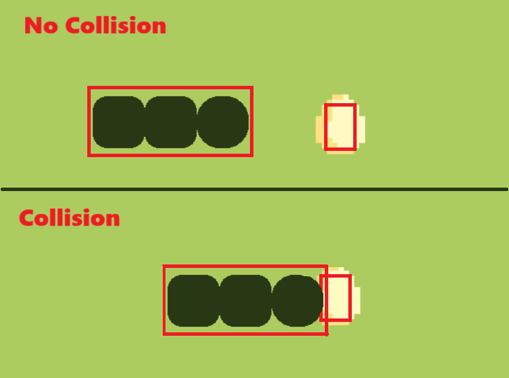

# Basics of Game and Pygame
---
তোমরা এখানে! আরে আরে কোথায় যাও! এসে যখন পড়েছো, Game development এবং Pygame সম্পর্কে কিছু শিখে যাও। 

#### # Pygame আবার কোন গেম? (◔_◔)
---
ধুরো! Pygame কোনো game না। ইহা Python এর একটি library যা দিয়ে আমরা গেম বানাতে পারি। আমি ধরে নিচ্ছি যে তোমরা সবাই Python এবং Python, OOP এর basics জানো। আমরা আজকে python এবং Object-oriented programming এর basics নিয়ে তেমন কিছু আলোচনা করবো না। 

শিখার যাত্রাটা Pygame install করার মাধ্যমে শুরু করলে খারাপ হয় না। Pygame install এর জন্য আমাদের কম্পিউটারে Python থাকতে হবে। যদি Python না থাকে তাহলে [python.org](https://www.python.org/downloads) থেকে stable version ডাউনলোড করে নিতে পারো। 

এখন আমরা Pygame install করার জন্য প্রস্তুত । যদি তুমি এখন Windows কম্পিউটার ব্যবহার করে থাকো তাহলে তুমি CMD(Command prompt) এ গিয়ে নিচের লাইনটা execute করো। 
```
pip install pygame
```
যদি Windows না হয়ে Linux, Mac ব্যবহার করে থাকো তাহলে এইটা Terminal এ execute করো।
```
pip3 install pygame
```

Pygame শিখার জন্য এখন আমরা প্রস্তুত, কিন্তু গেম ডেভেলপমেন্ট নিয়ে আলোচনা করার আগে কম্পিউটার গেমসকে একটু নতুন ভাবে চিনে আসা যাক, 

#### # গেম কি আলিবাবার বাক্স? ¯\\(°_o)/¯
---
প্রচলিত ধারণা থেকে খুব সহজে আমরা বলতে পারি গেম বিনোদনের একটা মাধ্যম ছাড়া আর কিছুই না। যে গেম গুলো আমরা কম্পিউটার এ খেলে থাকি সেগুলোকে আমরা কম্পিউটার গেম বলে আখ্যায়িত করি, তাই না? কিন্তু এই সংজ্ঞা আমাদের কম্পিউটার গেম বানাতে কোনো কাজে আসবে না! তাহলে গেম এর সংজ্ঞা কি হতে পারে?

একবিংশ শতাব্দীতে এসে আমরা কে-ই বা মুভি না দেখি! এখন একটু চিন্তা করা যাক একটা মুভি আসলে কি? একটা মুভি হলো অনেক ক্ষুদ্র সময়ে ছবির ক্রমাগত পরিবর্তন। এটা আবার কি বলে ফেললাম! ঠিকই শুনেছো। একটা মুভি, অনেক গুলো ছবির সমন্বয়ে বানানো হয়। যেখানে ছবি গুলিকে এতো যলদি পরিবর্তন করে দেখানো হয় যে আমাদের মস্তিষ্ক মনে করে এটা একটা চলমান দৃশ্য। এই প্রসেসটাকে বলে অ্যানিমেশন এবং এই ধারার মুভি গুলোকে বলে এনিমেটেড মুভি। এই অ্যানিমেশন অথবা ছবি পরিবর্তন হওয়ার ক্রম মুভির কাহিনীর উপর ভিত্তি করে ঠিক করা হয়। অর্থাৎ, ছবি পরিবর্তনের ক্রম ঠিক করার মাধ্যমে, মুভির ঘটনা ক্রম আমরা চাইলেই নিজের মত সাজিয়ে নিতে পারি। এখন কথা হলো আমি এটা নিয়ে কেন এতো কিছু বললাম?

তোমরা নিজেই চিন্তা করো, যদি এই রকম একটা এনিমেটেড মুভিতে অ্যানিমেশন/ছবি পরিবর্তনের ক্রম তুমি মুভি দেখার সময় পরিবর্তন করতে পারো তাহলে ব্যাপার টা কি দাঁড়াবে? এটা কি আর মুভি থাকবে? না, তখন আমরা এটা কে গেম বলতে পারি, তাই না!

##### তাহলে এবার আমরা বলতে পারি যে গেম, একটা Interacive Animated মুভি ছাড়া আর এর কিছুই না।

#### # GameLoop কি আলাদিনের জ্বীন না গেমের জিন?  ԅ(≖‿≖ԅ)
---
এখন আমরা জানি যে গেম আসলে কি। চলো আমরা একটা diagram দেখে আসি যেটা আমাদের গেম এর সংজ্ঞা কে সমর্থন করে -
<br>
<div style="text-align: center;">
    
</div>
<br>

আমরা এখন পর্যন্ত যা আলোচনা করলাম তা এখানে অনেক সহজে দেখানো হয়েছে। এখন এই diagram নিয়ে আরো কিছু আলোচনা করা যাক। কেননা যেকোনো গেম বানাতে আমাদের এই diagram টা implement করতে হবে, তারপর আমরা আমাদের গেম এর প্রয়োজন অনুযায়ী আরো অনেক features develop করে থাকি।

##### Diagram এ আমরা তিনটা core functionality দেখতে পারছি - Render, Input এবং Update। এই functionality গুলিকে একত্রে বলা হয় "GameLoop"।

কেন loop বলছি? কারণ এই functionality গুলো গেম শুরু থেকে বন্ধ করার আগ পর্যন্ত চক্রাকারে চলতে থাকে। আজকে আমাদের মূল লক্ষ্য হলো Pygame দিয়ে এই 'GameLoop' implement করার মাধ্যমে একটা simple snake গেম develop করা।

#### # GameLoop এর ময়নাতদন্ত ! (ง •̀_•́)ง
---
এবার দেখা যাক GameLoop এর ভিতর কি কি কাজ করা হয়,

* Render : মনে আছে সেই অ্যানিমেশন/ছবি পরিবর্তন করার কথা? সাধারণত render component এ আমরা অ্যানিমেশন রিলেটেড কোড করে থাকি। আমরা আরো সহজে বলতে পারি এখানে আমরা গ্রাফিক্স এর কাজ করে থাকি।

* Input : এখানে আমরা user থেকে নেওয়া নির্দেশনা(input) গ্রহণ এবং input processing এর কোড করে থাকি। এই নির্দেশনা গুলো হতে পারে keyboard key press/release, mouse motion/click, touch ইত্যাদি ।

* Update : user input event, time ইত্যাদির উপর ভিত্তি করে গেম এর কাহিনী, গ্রাফিক্স এবং গেমের  সাথে জড়িত আরো কিছু কাজ যেমন, NPC's(Non-Player Character) movement, player movement, game score, game state ইত্যাদি পরিবর্তন করতে হয় যার কোড GameLoop এর এই component এ করা হয়। 

> Clock/FPS : Frames per Second ইহা আবার কি? এটা নতুন কিছু না, ঐযে ক্ষুদ্র সময়ে ছবি পরিবর্তনের হারই FPS। GameLoop যত দ্রুত চলবে FPS তত বেশি হবে। সুতরাং, আমরা বলতে পারি GameLoop এবং FPS এর মধ্যে একটা সম্পর্ক রয়েছে। কিন্তু তা নিয়ে অন্যকোনো দিন কথা বলা যাবে।

#### # চলো এবার সাপ বানাই। 	ᕙ(`▽´)ᕗ
---
শুরুতেই বলে নেই এখানে গেমটার কোড OOP Approach এ করা হবে। কেননা, এখন গেম ডেভেলপমেন্টে OOP Approach ব্যবহার করতে উৎসাহিত করা হয় এবং আমি নিজেও OOP Approach ব্যবহার করে থাকি।

এখন, কোড দেখার আগে আমরা দুইটা system সম্পর্কে একটু জেনে আসি। 

##### Rectangle Collision System
যেকোনো গেমে আমাদের collision system লাগবেই। আমাদের snake গেমের কথাই ধরা যাক, গেমে snake যে একটা food খেতে পারবে এবং গেমে score কখন বাড়াবো তা বুঝবো কিভাবে? এইতো বুঝেগেছো, যখন snake এবং food এর object এর সংঘর্ষ (collision) হবে।

Rectangle collision system হলো সবচেয়ে সহজ collision system বলে আমার মনে হয়।
এখানে করতে কি হয়? আমরা আমাদের প্রতিটি ছবি অথবা গেমে object কে একটা করে Rectangle দিয়ে রাখি, যেটা গেমে খেলার সময় দেখা যায় না। 

এই Rectangle গুলি ছবিগুলোর সাথে move করে। তবে প্রশ্ন থেকেই যাই যে এমনটা কেন? 

কারণ দুইটা ছবির মধ্যে collision হয়েছে কিনা তা বের করা যত কঠিন, দুইটা Rectangle এর ভিতর তা বের করা তোতো সোজা। অংকের ভিতর আমি এখন যাবো না। কেননা, Pygame এটা আমাদের জন্য আগে থেকেই করে রেখেছে, আমরা শুধু তা ব্যবহার করবো, তবে তোমরা চাইলে দেখে নিতে পারো যে, দুটি Rectangle এর collision কিভাবে বের করা যায়।

<br>
<div style="text-align: center;">
    
</div>
<br>

##### Grid system
একটি গ্রিড সিস্টেম হলো একটি দ্বি-মাত্রিক স্থানের মধ্যে গেমের উপাদান(objects), গ্রাফিক্স বা গেমপ্লেকে সংগঠিত এবং গঠন করার একটি উপায়। গ্রিডের প্রতিটি কক্ষ একটি নির্দিষ্ট অবস্থানের প্রতিনিধিত্ব করে এবং সামগ্রিক কাঠামো গেম লজিক, সংঘর্ষ সনাক্তকরণ এবং বস্তুর স্থান নির্ধারণকে সহজ করে তোলে। গ্রিড সিস্টেমগুলি সাধারণত 2D গেমগুলিতে পরিবেশ, স্তর তৈরি করতে এবং গেম entity পরিচালনা করতে ব্যবহার করা হয়।

##### Computer Graphics System
বলাই বাহুল্য যে কম্পিউটার গ্রাফিক্সে (x, y) এর মান একটু ভিন্নভাবে কাজ করে। সাধারণত (0, 0) বিন্দুর অবস্থান মাঝখানে থাকার কথা।  তবে কম্পিউটার গ্রাফিক্সে (0, 0) বিন্দু top-left corner এ থাকে। ঠিক আছে বুঝলাম! আরে দাড়াও, এখনো শেষ হয় নি! মজার কথাতো বাকি আছে এখনও। কম্পিউটার গ্রাফিক্সে y এর মান উল্টাভাবে কাজ করে।

উল্টাভাবে কাজ করে! মানে কি? এর মানে হলো যদি y এর মান বাড়ানো হয় তাহলে object নিচে নামে এবং y এর মান যদি কমানো হয় তাহলে object উপরে উঠে। মজার না ব্যাপারটা?
<br>
<div style="text-align: center;">
    
</div>
<br>

##### *** তোমরা ইচ্ছে করলে snake গেমের source code-টি নিচের link থেকে দেখে নিতে পারো। 
##### --> [Self Explanatory Source Code](https://github.com/FatinShadab/PygameBasics/blob/main/src/main.py)

ভয় পেলে নাকি? আরেহ ভয়ের কিছু নেই, আসো, কিছু ধাপে code-টি বিশ্লেষণ করা যাক -

##### Direction Class:
ভিক্টর দিয়ে বিভিন্ন দিক represent করে (RIGHT, LEFT, UP, DOWN)।
স্নেকের চলনার জন্য ব্যবহৃত হয়।
```
class Direction:
    """
    Used for representing different directions.
    """
    RIGHT: pygame.math.Vector2 = pygame.math.Vector2(1, 0)
    LEFT: pygame.math.Vector2 = pygame.math.Vector2(-1, 0)
    UP: pygame.math.Vector2 = pygame.math.Vector2(0, -1)
    DOWN: pygame.math.Vector2 = pygame.math.Vector2(0, 1)
```

##### Food Class:
গেমে Food object-এর গেমে লজিক এবং রেন্ডার এর কাজ গুলো করার জন্য লেখা হয়েছে। 
```
class Food:
    """
    Represents the food object in the game.
    """
    def __init__(self, scaledWH: Optional[Tuple[int, int]] = None) -> None:
        """
        Initialize the Food object.

        Parameters:
            scaledWH (tuple): Tuple specifying the scaled width and height of the food image.
        """

    def get_render_object(self) -> pygame.Surface:
        """
        Get the render object (image) of the food.

        Returns:
            pygame.Surface: The rendered image of the food.
        """

    def get_random_render_pos(self, xRange: Tuple[int, int], yRange: Tuple[int, int]) -> pygame.Rect:
        """
        Get a random position for rendering the food.

        Parameters:
            xRange (tuple): Tuple specifying the range of x-coordinate for the random position.
            yRange (tuple): Tuple specifying the range of y-coordinate for the random position.

        Returns:
            pygame.Rect: Rectangle representing the random position for rendering the food.
        """
```

##### Snake Class:
গেমে snake-এর game logic, যেমন movement, growth, body এবং render object related কোড করা হয়েছে।
- মেথডস:
    - update(): sanke-এর দিক ভিত্তিক অবস্থান আপডেট করে।
    - get_render_object(): sanke-এর body (values to draw rectangles) return করে।
    - get_snake_head(): sanke-এর head (values to draw rectangles) return করে।
    - grow(): sanke-এর দৈর্ঘ্য বাড়াতে একটি শরীর(Rectangle) অংশ যোগ করে।
    - reset(): sanke-টি তার ডিফল্ট অবস্থায় রিসেট করে।
```
class Snake:
    """
    Represents the snake object in the game.
    """
    COLOR: Tuple[int, int, int] = (40, 55, 20)

    def __init__(self, cellWH: Tuple[int, int]) -> None:
        """
        Initialize the Snake object.

        Parameters:
            cellWH (tuple): Tuple specifying the width and height of each cell in the snake.
        """

    def update(self) -> None:
        """
        Update the position of the snake based on its direction.
        """

    def get_render_object(self) -> List[Tuple[int, int, int, int]]:
        """
        Get the render objects (rectangles) for each body part of the snake.

        Returns:
            list: List of tuples, where each tuple represents the (x, y, width, height) of a body part.
        """

    def get_snake_head(self) -> pygame.Rect:
        """
        Get the rectangle representing the head of the snake.

        Returns:
            pygame.Rect: Rectangle representing the head of the snake.
        """

    def grow(self) -> None:
        """
        Increase the length of the snake by adding a body part.
        """

    def reset(self) -> None:
        """
        Reset the snake to its default state.
        """
        self.direction = self.defaultDirection

        # Initial body parts of the snake
```

##### Game Class:
Game World, Rendering, Input এবং Update সম্পর্কিত কাজ করে।
- মেথডস:
    - config_audio(): গেম Sound লোড এবং কনফিগার করে।
    - update_high_score(): বর্তমান স্কোরের উপরে হাই স্কোর আপডেট করে।
    - handle_food_snake_collision(): Snake এবং Food মধ্যে collision, score আপডেট এবং sound নিয়ন্ত্রণ করে।
    - termination_event_ocurred(): গেম সমাপ্তির শর্ত চেক করে।
    - render_menu(): মেনু স্ক্রিন রেন্ডার করে।
    - render(): গেম রেন্ডার করে, প্লে এরিয়া, score, snake, food এবং menu / pause screen সহ।
    - input(): user input নিয়ন্ত্রণ করে, যাতে খেলা শুরু হয়, এটি বিরত হয় এবং sanke-এর দিক পরিবর্তন হয়।
    - update(): game world আপডেট করে, game logic নিয়ন্ত্রণ করে।
    - cleanup(): ram পরিষ্কার করে এবং গেম থেকে বাহির হয়।
    - gameLoop(): GameLoop-এর ইমপ্লিমেন্টেশন।
    - run(): গেম শুরু করে।

##### *** তোমাদের সুবিধার্তে পুরো __ এর মধ্যে থেকে __ এর ইম্প্লিমেন্টেশনটা আবার দেখছি,
##### # Game loop implementation
```
# Game loop implementation
class Game:
    # ... (constants and methods)

    def __init__(self):
        pygame.init()
        # ... (initialize game properties)

    def gameLoop(self):
        while self.runFlag:
            self.input()
            if self.state == Game.Play:
                self.update()
            self.render()

            pygame.display.flip()
            pygame.display.update()

            self.gameClock.tick(self.maxFPS)
```

##### # আমরা pygame-এর কোন কোন features ব্যবহার করলাম তা দেখে আসা যাক  -
- ##### # Initialization and Setup:
    - * [pygame.init()](https://www.pygame.org/docs/ref/pygame.html#pygame.init) : এই function-টা call করার মাধ্যমে আমরা pygame এর imported modules-গুলিকে আগে থেকেই initialize করে রাখা হচ্ছে, যাতে আমরা modules-গুলি সময় মতো ব্যবহার করতে পারি।
    ```
    pygame.init()
    ```
    - * [pygame.quit()](https://www.pygame.org/docs/ref/pygame.html#pygame.quit) : এই function-টা init()-এর উল্টা, যেমন init(), imported modules-গুলিকে initialize করে তেমন quit() uninitialize করে।
    ```
    pygame.quit()
    ```

- ##### # Window and Display:
    - * [pygame.display.set_mode(size=(w, h), ...)](https://www.pygame.org/docs/ref/display.html#pygame.display.set_mode) : আমাদের গেমের main window (যেটাতে close (X) বাটন থাকে) create হবে, এবং main window এর দৈর্ঘ্য(Width), প্রস্থ/উচ্চতা(Height) আমরা একটা tuple pass করার মাধ্যমে সেট করে দিতে পারি। 
    ```
    self.cellCount: int = 16
    self.cellSize: int = 50
    self.windowWH: Tuple[int, int] = (
        self.cellCount * self.cellSize,
        self.cellCount * self.cellSize
    )
    self.window: pygame.Surface = pygame.display.set_mode(self.windowWH)
    ```
    - * [pygame.display.set_caption(title: str, ...)](https://www.pygame.org/docs/ref/display.html#pygame.display.set_caption) : এই ফাংশন গেম উইন্ডোর শিরোনাম সেট করে। শিরোনামটি একটি স্ট্রিং যা উইন্ডোর শিরোনাম বারে প্রদর্শিত হবে।
    ```
    pygame.display.set_caption("PySnake")
    ```
    - * [pygame.display.flip()](https://www.pygame.org/docs/ref/display.html#pygame.display.flip) : এই ফাংশনটি সম্পূর্ণ গেম ডিসপ্লে আপডেট করে। পুরো স্ক্রীন রিফ্রেশ করতে এটি সাধারণত প্রতি ফ্রেমে একবার call হয়। পরিবর্তনগুলি দৃশ্যমান কিনা তা নিশ্চিত করতে এটি pygame.display.update() এর সাথে ব্যবহার করা উচিত।
    ```
    pygame.display.flip()
    ```
    - * [pygame.display.update()](https://www.pygame.org/docs/ref/display.html#pygame.display.update) : এই ফাংশনটি স্ক্রিনের(pygame main surface) কিছু অংশ আপডেট করে। এটি প্রায়শই স্ক্রিনের নির্দিষ্ট অঞ্চলগুলিকে আপডেট করে রেন্ডারিং অপ্টিমাইজ করতে ব্যবহৃত হয়। প্রদত্ত কোডে, এটি গেম ডিসপ্লে আপডেট করতে pygame.display.flip() এর পাশাপাশি কাজ করে।
    ```
    pygame.display.update()
    ```

- ##### # Rendering Objects and Images:
    - * [pygame.image.load()](https://www.pygame.org/docs/ref/image.html#pygame.image.load) : এই ফাংশনটি Pygame ইমেজ মডিউলের একটি অংশ এবং একটি ফাইল থেকে ছবি লোড করার জন্য ব্যবহৃত হয়।
    ```
    self.image: pygame.Surface = pygame.image.load("resources/egg.png").convert_alpha()
    ```
    - * [pygame.transform.scale()](https://www.pygame.org/docs/ref/transform.html#pygame.transform.scale) : এই ফাংশনটি একটি surface/image-কে একটি নতুন আকারে, আকার পরিবর্তন করতে ব্যবহৃত হয়।
    ```
    self.image = pygame.transform.scale(self.image, scaledWH)
    ```
    - * [pygame.Rect(x, y, w, h, ...)](https://www.pygame.org/docs/ref/rect.html) : Rect-ক্লাসটি pygame main surface (window)-তে একটি আয়তক্ষেত্রাকার এলাকা প্রতিনিধিত্ব করে। গেমের ক্ষেত্র, সাপের মাথা এবং খাবারের মতো গেম object-গুলির মাত্রা এবং অবস্থান নির্ধারণের জন্য এটি ব্যাপকভাবে ব্যবহৃত হয়। Rect ক্লাস collision (সংঘর্ষ ) সনাক্তকরণ এবং আয়তক্ষেত্রাকার অঞ্চলগুলির manipulation- করার methods সরবরাহ করে।
    ```
    self.playArea = pygame.Rect(5, 40, self.width - 10, self.height - 45)
    ```
    - * [pygame.Surface.blit()](https://www.pygame.org/docs/ref/surface.html#pygame.Surface.blit) : 'blit'(Block Image Transfer) পদ্ধতিটি একটি surface-কে(font/image) অন্য surface-এ আঁকতে ব্যবহৃত হয়। এটি মূলত একটি নির্দিষ্ট অবস্থানে একটি surface থেকে অন্য surface-এ পিক্সেল কপি করে। কোডে, এটি গেম উইন্ডোতে বিভিন্ন গেমের উপাদান রেন্ডার করতে ব্যবহৃত হয়, যেমন খাবার, সাপ এবং মেনু উপাদান।
    ```
    self.window.blit(self.food.get_render_object(), self.foodPos)
    ```
    - * [pygame.draw.rect()](https://www.pygame.org/docs/ref/draw.html#pygame.draw.rect) : draw.rect ফাংশনটি একটি surface-এর উপর একটি আয়তক্ষেত্র আঁকতে ব্যবহৃত হয়।
    ```
    pygame.draw.rect(self.window, (6, 2, 26), self.playArea, 15)
    ```
    - * [pygame.draw.circle()](https://www.pygame.org/docs/ref/draw.html#pygame.draw.circle) : Surface-এর উপর একটি বৃত্ত আঁকতে draw.circle ফাংশন ব্যবহার করা হয়। কোডে, এটি একটি বৃত্তাকার মেনু background তৈরি করতে বৃত্ত আঁকতে ব্যবহৃত হয়।
    ```
    pygame.draw.circle(self.window, "Black", (self.width / 2, self.height / 2), self.width / 2.4)
    pygame.draw.circle(self.window, (30, 60, 30), (self.width / 2, self.height / 2), self.width / 2.5)
    ```
    - * [pygame.Surface.fill()](https://www.pygame.org/docs/ref/surface.html#pygame.Surface.fill) : সম্পূর্ণ সারফেস একটি solid color দিয়ে পূরণ করতে 'fill' function ব্যবহার করা হয়।
    ```
    self.window.fill(self.backgroundColor)
    ```

- ##### # Sound Handling:
    - * [pygame.mixer.Sound()](https://www.pygame.org/docs/ref/mixer.html) : Pygame-এ সাউন্ড ইফেক্ট পরিচালনার জন্য 'Sound' class ব্যবহার করা হয়। এটি সাউন্ড ফাইল লোড করে এবং শব্দ চালানো, থামাতে এবং ম্যানিপুলেট করার পদ্ধতি প্রদান করে। কোডে, এটি খাওয়া (eatSE), আঘাত (hitSE), এবং হিসিং (hissSE) এর জন্য বিভিন্ন সাউন্ড ইফেক্ট লোড করতে ব্যবহৃত করা হয়েছে।
    ```
    self.eatSE = pygame.mixer.Sound("resources/hiss3-103123.mp3")
    self.hitSE = pygame.mixer.Sound("resources/loss.mp3")
    self.hissSE = pygame.mixer.Sound("resources/hiss.mp3")
    ```

- ##### # Event Handling:
    - * [pygame.event.get()](https://www.pygame.org/docs/ref/event.html#pygame.event.get) : event.get ফাংশন event queue(SDL event queue) থেকে সমস্ত event retrieve করে। কোডে, এটি user input-গুলি পরিচালনা করতে ব্যবহৃত হয়, যেমন key press এবং window close event।
    ```
    for event in pygame.event.get():
        # ... (event handling logic)
    ```
    - * [pygame.event.custom_type()](https://www.pygame.org/docs/ref/event.html#pygame.event.custom_type) : এই ফাংশনটি pygame-এর একটি কাস্টম Event টাইপ তৈরি করে। প্রদত্ত কোডে, এটি স্বয়ংক্রিয় সাপের গতিবিধি (AUTO_SNAKE_MOVEMENT) এবং হিস শব্দ (AUTO_HISS_SOUND) বাজানোর জন্য কাস্টম Event-এর ধরন নির্ধারণ করতে ব্যবহৃত হয়। এই কাস্টম ইভেন্টগুলি গেমটিকে নিয়মিত বিরতিতে নির্দিষ্ট ক্রিয়াগুলি ট্রিগার করার অনুমতি দেয়।
    ```
    AUTO_SNAKE_MOVEMENT = pygame.event.custom_type()
    AUTO_HISS_SOUND = pygame.event.custom_type()
    ```

- ##### # Fonts:
    - * [pygame.font.Font()](https://www.pygame.org/docs/ref/font.html#pygame.font.Font) : Pygame-এ টেক্সট রেন্ডার করতে ফন্ট ক্লাস ব্যবহার করা হয়। এটি একটি ফন্ট ফাইলের পথ এবং ফন্টের আকারের সাথে শুরু করা হয়। এই ক্লাসটি আমাদেরকে টেক্সট অবজেক্ট তৈরি করতে দেয় যা গেম উইন্ডোতে প্রদর্শিত হতে পারে।
    ```
    self.font = pygame.font.Font("resources/Pixeltype.ttf", 50)
    self.font.bold = True
    ```

- ##### # Vector
    - * [pygame.math.Vector2()](https://www.pygame.org/docs/ref/math.html#pygame.math.Vector2) : Vector2 ব্যবহার করা হয় 2D ভেক্টরের প্রতিনিধিত্ব করতে এবং ম্যানিপুলেট করার জন্য, snake game-এর কোডে movement logic-কে সহজে ইমপ্লিমেন্ট করতে ব্যবহার করা হয়েছে ।
    ```
    class Direction:
        RIGHT = pygame.math.Vector2(1, 0)
        LEFT = pygame.math.Vector2(-1, 0)
        UP = pygame.math.Vector2(0, -1)
        DOWN = pygame.math.Vector2(0, 1)
    ```

- ##### # Timing and Clock:
    - * [pygame.time.set_timer(event, time gap)](https://www.pygame.org/docs/ref/time.html#pygame.time.set_timer) : set_timer ফাংশনটি নির্দিষ্ট ব্যবধানে বারবার ইভেন্ট তৈরি করতে ব্যবহৃত হয়। কোডে, এটি নিয়মিত বিরতিতে কাস্টম ইভেন্ট AUTO_SNAKE_MOVEMENT এবং AUTO_HISS_SOUND ট্রিগার করতে ব্যবহৃত হয়, স্বয়ংক্রিয় সাপের চলাচল এবং পর্যায়ক্রমিক হিসিং শব্দ সক্ষম করে।
    ```
    pygame.time.set_timer(Game.AUTO_SNAKE_MOVEMENT, 200) # 200 millisecond
    pygame.time.set_timer(Game.AUTO_HISS_SOUND, 5000) # 5000 millisecond
    ```
    - * [pygame.time.Clock()](https://www.pygame.org/docs/ref/time.html#pygame.time.Clock) : এই Clock হলো একটা python class যার instance ব্যবহার করে আমরা গেমের run-time এবং fps রিলেটেড কাজ করতে পারি।
    ```
    self.gameClock = pygame.time.Clock()
    self.maxFPS = 60
    ```

#### আরেহ, এই দেখি আমরা আজকের মতো আমাদের আড্ডার সমাপ্তিতে এসে পড়েছি। তবে বিদায় নেয়ার আগে শেষ একটা কথা, আজকের আড্ডা থেকে আমরা যা জানলাম তা আমাদের গেমে ডেভেলপার অথবা pygame-এ বিশেষজ্ঞ বানাবে না।  তাহলে এখন কি করবো? এখন তোমরা pygame দিয়ে ছোট ছোট গেমে বানানোর চেষ্টা করবে এবং pygame নিয়ে আরো জানার জন্য pygame এর documentation উনুসরণ করবে।  

##### Reference : [pygame doc](https://www.pygame.org/docs/)
